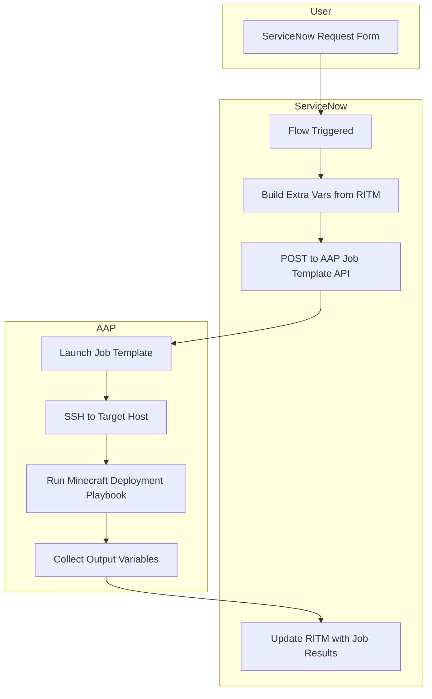

## Introduction

What if provisioning infrastructure was as easy, and fun, as launching a Minecraft server?

In this post, we will walk through how to deploy a **Vanilla Minecraft server** using **Ansible Automation Platform**(AAP) and **ServiceNow**(SNOW). While it may sound like just a fun side project, this demo highlights how enterprise-grade tools can deliver **governed, repeatable, and self-service automation**, even for complex environments.

You might be thinking: *“Sure, but what does Minecraft have to do with enterprise IT?”*  
Here’s the trick, **Minecraft is just a Java application running on a server**. What we’re really demonstrating is a reusable pattern for deploying pre-baked application environments. The same techniques could apply to **Tomcat, .NET apps, Nginx, database servers**, or other internal services. It’s a fun way to explore serious automation.

We’ll walk through the playbook design, the ServiceNow integration, and how this architecture maps to real-world workflows you’d find in a modern enterprise environment.

## Overview and Assumptions

Here’s what this project uses:

- **Ansible Automation Platform**: Executes the automation playbook.
- **ServiceNow**: Serves as the front-end request system.
- **Custom Execution Environment**: Prebuilt at [quay.io/bgrimmet/starbase/mc-ee](https://quay.io/repository/bgrimmet/starbase/mc-ee).
- **Proxmox**: Hosts the Minecraft VM.
- **mcrcon**: Applies post-deployment admin settings via RCON.

To keep this post focused, I’m using a **pre-provisioned server**. A follow-up blog (shameless plug!) will cover how I deploy virtual machines into my environment with patterns and recommendations for building your own infrastructure pipeline.

## Walking Through the Playbook

### Playbook Purpose and Variables

This playbook orchestrates the full lifecycle of deploying a Minecraft server, leveraging both system-level automation and dynamic variables passed from ServiceNow. The following variables are passed in via the ServiceNow form submission:

```yaml
world_name: funworld
admin_players: Baconator1013, BadUsernameForAnsible2Catch
max_players: '5'
snow_rtim: RITM0011600
justification: Because we can!!
world_seed: AnsibleIsReallyCool
```

These values will drive the configuration of the Minecraft instance, define who has admin access, and help link the deployment back to the original ServiceNow request.

### Pre-Tasks

#### Cleanup and Assertions

The first part of the playbook ensures **idempotency** by stopping and removing any previously deployed Minecraft server. This prevents conflicts during redeployment and avoids stale configuration or leftover files from earlier runs.

When testing changes to the playbook, this step is especially useful—it guarantees that every run reflects the latest logic and variables at runtime.

```yaml
- name: Ensure no existing Minecraft server
  ignore_errors: true
  become: true
  block:
    - name: Stop existing server
      ansible.builtin.systemd:
        name: minecraft.service
        state: stopped

    - name: Remove /opt/minecraft directory
      ansible.builtin.file:
        path: /opt/minecraft/
        state: absent
```

One recommended practices I like to include in the **pre-tasks** of an Ansible playbook is to **assert that all required variables are defined** before continuing with any automation logic. This ensures that `extra_vars` passed from tools like ServiceNow are populated correctly, and that we avoid wasting time (or causing errors) by running tasks with missing inputs.

By failing fast, we create a more robust and predictable automation flow.

```yaml
- name: Assert required variables
  ansible.builtin.assert:
    that:
      - environment | trim | length > 0
      - world_name | trim | length > 0
      - admin_players | trim | length > 0
      - max_players | trim | length > 0
      - justification | trim | length > 0
      - world_seed | trim | length > 0
    fail_msg: "Missing required variables."
```

#### Validating Server Sizing

Now that our variables have been validated, the next step is to ensure the system is properly provisioned for the scale at which it will operate.

In the ServiceNow request, I limited the selectable values for `max_players` to 1, 5, and 10. These values map to a RAM allocation strategy based on recommendations from [Apex Hosting’s Minecraft server sizing calculator](https://apexminecrafthosting.com/how-much-ram-do-i-need-for-my-server/):

| **RAM** | **Player Slots*** | **World Size*** | **Plugin/Mods*** |
|---------|-------------------|------------------|------------------|
| 2GB     | Up to 10          | Up to 8GB        | Up to 10         |
| 3GB     | Up to 15          | Up to 10GB       | Up to 25         |
| 4GB     | Up to 25          | Up to 15GB       | Up to 40         |
| 5GB     | Up to 30          | Up to 20GB       | Up to 45         |
| 6GB     | Up to 40          | Up to 30GB       | Up to 50         |
| 8GB     | Up to 90          | Up to 60GB       | 50+              |
| 10GB    | 150+              | Up to 100GB      | 50+              |
| 16GB    | 150+              | 150+ GB          | 50+              |

Using Ansible facts and a RAM allocation jinja template, we can programmatically determine whether the target system has enough memory to support the requested player count. I also ensure there's at least **256MB reserved** for the OS to maintain stability during gameplay.

```yaml
- name: Set and validate system memory allocations
  block:
    - name: Set memory allocations based on max_players
      set_fact:
        min_memory: >-
          
            512M
          
            1G
          
            2G
          
            4G
          
        max_memory: >-
          
            1G
          
            2G
          
            4G
          
            6G
          

    - name: Convert max_memory to integer MB
      set_fact:
        max_memory_mb: >-
          
            {{ (max_memory | regex_replace('G', '') | int) * 1024 }}
          
            {{ max_memory | regex_replace('M', '') | int }}
          
            {{ max_memory | int }}
          

    - name: Assert server has enough RAM for max_memory
      ansible.builtin.assert:
        that:
          - ansible_memtotal_mb >= (max_memory_mb | int + 256)  # +256MB for OS
        fail_msg: >-
          Not enough RAM for the configured max_memory ({{ max_memory }}).
          Total system memory is {{ ansible_memtotal_mb }}MB,
          required is at least {{ (max_memory_mb | int + 256) }}MB.
```
> Note: These are conservative/example estimates. If you’re running mods, higher render distances, or redstone-heavy builds, you may need more RAM per player.

### Generating an RCON Password for Remote Administration

To support remote administration after deployment, we’re enabling **RCON**, a built-in remote console protocol used by Minecraft servers. RCON allows administrators to send commands to the server without needing shell access or a direct console session. This is especially useful for automated tasks like:

- Granting operator privileges
- Running backup or shutdown commands
- Changing game rules or settings on the fly

We’ll be using [MCRCON](https://github.com/Tiiffi/mcrcon), a lightweight command-line RCON client written in C. It integrates easily with automation workflows and is ideal for issuing secure remote commands as part of your playbook.

To enable this, we generate a random RCON password using Ansible's [`password` lookup plugin](https://docs.ansible.com/ansible/latest/collections/ansible/builtin/password_lookup.html). This ensures a strong, unique password is created for each server deployment.

```yaml
- name: Generate RCON password
  ansible.builtin.set_fact:
    rcon_password: "{{ lookup('password', '/dev/null length=16 chars=ascii_letters,digits') }}"
```
This password will later be used both in the Minecraft server configuration (server.properties) and by the MCRCON client to securely connect and issue admin commands.

> You could also persist the generated password to a secure secrets store (ex: HashiCorp Vault or CyberArk) depending on your organization's practices.

### Installing Dependencies

Most deployments require downloading system-level software. For Minecraft, the primary dependency is Java, specifically **Java 21** in this case.

On **RHEL-based systems**, the required package is: `java-21-openjdk-devel`

On **Debian-based systems**, the equivalent package would be: `openjdk-21-jdk-headless`

Since we are installing the RHEL package using the yum module. Note that become: true is set at the task level, rather than globally from the practice of using privilege escalation only when needed.

```yaml
- name: Install packages
  become: true
  ansible.builtin.yum:
    name:
      - java-21-openjdk-devel
    state: present
```
### Downloading the Minecraft Server

Now it's time to set up the directory and download the Minecraft server binary. If you visit the [official Minecraft server download page](https://www.minecraft.net/en-us/download/server), you’ll notice it only provides the latest `.jar` file directly. While this works for simple setups, I wanted a more **dynamic approach** that can support version targeting in the future.

To achieve this, I'm using the [Mojang version manifest JSON](https://launchermeta.mojang.com/mc/game/version_manifest.json), which provides metadata for all available Minecraft versions—allowing the playbook to always fetch the **latest release** or even pin to specific versions later if needed. This method gives the deployment long-term flexibility: later I can add logic to specify a target version or use release channels (ex: snapshot vs. release). It also keeps the automation in sync with upstream releases—no hardcoded URLs required.

```yaml
- name: Create Minecraft directory
  become: true
  ansible.builtin.file:
    path: /opt/minecraft
    state: directory
    mode: '0755'

- name: Download Minecraft server
  block:
    - name: Get version manifest
      ansible.builtin.uri:
        url: https://launchermeta.mojang.com/mc/game/version_manifest.json
        return_content: true
      register: version_manifest

    - name: Extract release metadata URL
      ansible.builtin.set_fact:
        latest_version_info_url: >-
          {{
            (version_manifest.json.versions |
            selectattr("id", "equalto", version_manifest.json.latest.release) |
            list)[0].url
          }}

    - name: Fetch release metadata
      ansible.builtin.uri:
        url: "{{ latest_version_info_url }}"
        return_content: true
      register: latest_version_metadata

    - name: Extract server jar URL
      ansible.builtin.set_fact:
        server_jar_download_url: "{{ latest_version_metadata.json.downloads.server.url }}"

    - name: Download server.jar
      become: true
      ansible.builtin.get_url:
        url: "{{ server_jar_download_url }}"
        dest: /opt/minecraft/server.jar
```

### Initializing the Minecraft Server

At this point, the server files are downloaded, system dependencies are installed, and we're ready to **initialize the Minecraft server**.

The initialization process begins by running the server for the first time using:

```bash
java -jar /opt/minecraft/server.jar --nogui
```

This command—sourced from the [official Minecraft Server setup guide](https://minecraft.wiki/w/Tutorial:Setting_up_a_Java_Edition_server) generates all the required files and configuration stubs, including `eula.txt` and `server.properties`; however, the server will immediately exit with a message prompting you to **accept the EULA** before continuing. We handle this requirement automatically by modifying `eula.txt` via Ansible. At the same time, we take advantage of this pre-deployment step to configure key values in `server.properties`, such as:

- The maximum number of players
- The seed and world name
- Enabling RCON
- Injecting the generated RCON password

```yaml
- name: Generate server files
  become: true
  ansible.builtin.shell:
    cmd: java -jar /opt/minecraft/server.jar --nogui
    chdir: /opt/minecraft
  register: generate_output
  changed_when: true
  failed_when: "'You need to agree to the EULA' not in generate_output.stdout"

- name: Configure Minecraft server
  become: true
  block:
    - name: Accept EULA
      ansible.builtin.lineinfile:
        path: /opt/minecraft/eula.txt
        regexp: '^eula='
        line: eula=true

    - name: Update server.properties
      ansible.builtin.lineinfile:
        path: /opt/minecraft/server.properties
        regexp: "{{ item.regexp }}"
        line: "{{ item.line }}"
        create: true
      loop:
        - { regexp: '^max-players=', line: 'max-players={{ max_players }}' }
        - { regexp: '^level-seed=', line: 'level-seed={{ world_seed }}' }
        - { regexp: '^level-name=', line: 'level-name={{ world_name }}' }
        - { regexp: '^enable-rcon=', line: 'enable-rcon=true' }
        - { regexp: '^rcon.password=', line: 'rcon.password={{ rcon_password }}' }
```

To make the Minecraft server easy to manage and resilient, we’ll configure it to run as a `systemd` service. This allows it to be started, stopped, enabled on boot, and monitored like any other long-running system process. The service will use a custom `start.sh` script, which we generate using an Ansible template.

The server is started with both a **minimum and maximum RAM allocation**, which were calculated earlier using our sizing logic. This ensures optimal performance based on the expected number of players.

In addition, we open the necessary ports via `firewalld`:

- `25565/tcp`: the default Minecraft server port
- `25575/tcp`: the RCON port for remote administration

Finally, we pause for 2 minutes to allow the server to fully initialize before executing any post-deployment steps.

```yaml
- name: Setup systemd service
  become: true
  block:
    - name: Create start.sh
      ansible.builtin.template:
        src: templates/start.sh.j2
        dest: /opt/minecraft/start.sh
        mode: '0755'

    - name: Create systemd unit file
      ansible.builtin.template:
        src: templates/minecraft.service.j2
        dest: /etc/systemd/system/minecraft.service
        mode: '0644'

- name: Enable and start service
  become: true
  ansible.builtin.systemd:
    name: minecraft.service
    enabled: true
    state: started

- name: Configure firewalld
  become: true
  ansible.posix.firewalld:
    port: "{{ item }}"
    permanent: true
    state: enabled
  loop:
    - 25565/tcp
    - 25575/tcp

- name: Pause for server init
  ansible.builtin.pause:
    minutes: 2
```

### Granting Operator Privileges

With the server now up and running as a managed `systemd` service, it's time to configure administrative access for the players specified in the ServiceNow request.

In Minecraft, server administrators, commonly called **operators (OPs)**, have elevated privileges that allow them to manage the server in-game or through remote console commands. To automate this step, we use the Mojang API to validate the provided usernames and retrieve their official Minecraft UUIDs. This helps prevent granting OP status to invalid or misspelled usernames.

Once validated, we use **MCRCON** to issue the `op` command remotely to the running server instance for each verified user.

```yaml
- name: Grant admin users
  block:
    - name: Split usernames
      ansible.builtin.set_fact:
        usernames: "{{ admin_players.split(',') | map('trim') | list }}"

    - name: Validate with Mojang
      ansible.builtin.uri:
        url: "https://api.mojang.com/users/profiles/minecraft/{{ item }}"
        return_content: true
      loop: "{{ usernames }}"
      register: uuid_results
      failed_when: false

    - name: Filter valid users
      ansible.builtin.set_fact:
        valid_users: >-
          {{ uuid_results.results | selectattr('status', 'equalto', 200) | map(attribute='json.name') | list }}

    - name: Grant OP with RCON
      ansible.builtin.shell: |
        mcrcon -H {{ ansible_hostname }} -P 25575 -p '{{ rcon_password }}' "op {{ item }}"
      delegate_to: localhost
      loop: "{{ valid_users }}"

    - name: Debug granted users
      ansible.builtin.debug:
        msg: "Granted OP to: {{ item }}"
      loop: "{{ valid_users }}"
```
> This approach ensures we only grant privileges to real users and do so automatically, removing the need for manual intervention post-deploy.

### Updating the ServiceNow Ticket

To finalize the end-to-end automation, we update the ServiceNow request item (RITM) with key deployment details. This ensures traceability and provides the requester with all the necessary information to access and manage their newly provisioned Minecraft server. To do so, we need to perform the following:

1. **Lookup the RITM’s `sys_id`** by querying the ServiceNow API using the RITM number.
2. **Extract and store the `sys_id`** so we can reference the correct record.
3. **Post a comment to the ticket** with server metadata, including the world name, admin users, RCON password, and deployment status.

```yaml
- name: Comment on ServiceNow RITM
  block:
    - name: Get sys_id
      ansible.builtin.uri:
        url: "https://{{ servicenow_instance }}/api/now/table/sc_req_item?sysparm_query=number={{ snow_rtim }}"
        method: GET
        user: "{{ servicenow_user }}"
        password: "{{ servicenow_password }}"
        force_basic_auth: true
        headers:
          Accept: "application/json"
          Content-Type: "application/json"
        return_content: true
      register: ritm_lookup

    - name: Save sys_id
      ansible.builtin.set_fact:
        ritm_sys_id: "{{ ritm_lookup.json.result[0].sys_id }}"

    - name: Post comment
      ansible.builtin.uri:
        url: "https://{{ servicenow_instance }}/api/now/table/sc_req_item/{{ ritm_sys_id }}"
        method: PATCH
        user: "{{ servicenow_user }}"
        password: "{{ servicenow_password }}"
        force_basic_auth: true
        headers:
          Accept: "application/json"
          Content-Type: "application/json"
        body_format: json
        body:
          comments: |
            ✅ Minecraft Server Deployment Complete
            🌍 World Name: {{ world_name }}
            🔐 RCON Password: {{ rcon_password }}
            👥 Admin Players: {{ valid_users | join(', ') }}
            📦 Max Players: {{ max_players }}
            🌱 Seed: {{ world_seed }}
            🖥️ Host: {{ ansible_hostname }}
      when: snow_rtim is defined and snow_rtim | length > 0
```

### Post-Deployment Validation

After Ansible Automation Platform completes the job, it’s a good idea to verify that the Minecraft server has started successfully and is accepting connections.

On the target system, you can inspect the logs for the `minecraft.service` by using:

```bash
sudo journalctl -xeu minecraft.service
```

You're looking for a few key lines to confirm that:

- The server has fully started
- RCON is available
- Admin players were successfully granted OP status

Example log output from a successful deployment:

```
[Server thread/INFO]: Done (35.107s)! For help, type "help"
[Server thread/INFO]: Starting remote control listener
[Rcon: Made Baconator1013 a server operator]
```

Below is a fuller log snippet showing the startup process and confirmation that the server is initialized, RCON is running, and admin users were granted privileges:

```
Jul 12 18:59:32 sb-temp01 start.sh[309769]: [Server thread/INFO]: Done (35.107s)! For help, type "help"
Jul 12 18:59:32 sb-temp01 start.sh[309769]: [Server thread/INFO]: Starting remote control listener
Jul 12 18:59:32 sb-temp01 start.sh[309769]: [Server thread/INFO]: Thread RCON Listener started
Jul 12 18:59:32 sb-temp01 start.sh[309769]: [Server thread/INFO]: RCON running on 0.0.0.0:25575
Jul 12 19:00:48 sb-temp01 start.sh[309769]: [Server thread/INFO]: [Rcon: Made Baconator1013 a server operator]
```

This output confirms:

- The Minecraft server is **running**
- RCON is **listening on port 25575**
- The automation successfully used RCON to grant operator status to the admin players specified in the request

## Custom Execution Environment

To ensure portability and consistency, I built a **custom execution environment (EE)** using [`ansible-builder`](https://ansible.readthedocs.io/projects/builder/en/latest/). This EE includes all required dependencies for the Minecraft deployment workflow, such as:

- `ansible.posix` collection (for system-level tasks)
- `community.proxmox` collection (used for dynamic inventory targeting Proxmox)
- The `mcrcon` binary (for remote Minecraft administration via RCON)

This setup guarantees that the playbook can run in isolated, reproducible conditions—without relying on the control node's underlying OS or packages.

You can find the build definition in the GitHub repo under `execution-environment/mc-ee.yml`. To build it locally:

```bash
cd execution-environment/
ansible-builder build -v3 -t mc-ee:latest -f mc-ee.yml
```

If you'd rather use it directly, the image is published publicly: [quay.io/bgrimmet/starbase/mc-ee](https://quay.io/repository/bgrimmet/starbase/mc-ee)

> For more guidance on building and customizing execution environments, check out the sources at the end!

## Integrating ServiceNow with Ansible Automation Platform

To integrate ServiceNow with AAP, I followed the excellent guide by [Alex Dworjan](https://www.linkedin.com/in/alexanderdworjan/) from the [Shadowman Lab Ansible-SNOW repository](https://github.com/shadowman-lab/Ansible-SNOW/tree/main/SNOWSetup). His walkthrough explains how to use the **Ansible Spoke** in ServiceNow Flow Designer to trigger job templates in Ansible Automation Platform when a catalog request is submitted.

Using this setup, I connected a Minecraft server provisioning request form in ServiceNow to a fully automated AAP playbook, from user input to post-deployment feedback, without manual steps.

---

### How It Works

1. A user submits a Minecraft server request using a custom ServiceNow catalog form.
2. A **Flow Designer** workflow is triggered based on the submitted request item.
3. The flow reads field values, constructs an `extra_vars` dictionary, and makes a `POST` request to AAP’s REST API to launch a job template.
4. Ansible Automation Platform runs the job, deploying and configuring the server.
5. Once complete, the flow **updates the original RITM** in ServiceNow with key deployment details.

---

### Process Overview (Diagram)



### Visual Walkthrough

#### 1. ServiceNow Request Form


This is the custom request form used by end users to provision a Minecraft server. Fields such as world name, seed, justification, maximum players, and admin usernames are passed directly into the Ansible playbook via `extra_vars` using the Ansible Spoke.

#### 2. Flow Designer Automation Logic


This is the Flow Designer workflow that connects the catalog request to AAP. It:
- Reads the values submitted in the form
- Constructs the JSON payload for `extra_vars`
- Launches the appropriate job template

#### 3. AAP Job Template Execution


This screenshot shows the job template configured in **Ansible Automation Platform (AAP)** that is triggered by the ServiceNow flow. It receives the `extra_vars` payload—built dynamically from the ServiceNow request form, and runs the full playbook that:

- Validates the request data
- Installs dependencies
- Downloads and configures the Minecraft server
- Grants operator access via MCRCON
- Updates the originating ServiceNow ticket with deployment details

#### 4. AAP Job Template Execution


This screenshot shows the Ansible Automation Platform job launched by the ServiceNow flow. The job runs the Minecraft deployment playbook using the variables submitted from the request form and handles everything from provisioning to configuration and post-deployment reporting.

#### 5. Commenting the RITM with Server Details


Once the playbook completes, the flow uses the ServiceNow REST API to **patch the request item (RITM)** with a detailed comment. This comment provides the requester with all relevant deployment information:

- 🌍 World Name
- 🔐 RCON Password
- 👥 Admin Player List
- 📦 Maximum Player Count
- 🌱 World Seed
- 🖥️ Hostname of the deployed system

This closes the loop and provides full transparency, all within the ServiceNow record.

## Mapping to Enterprise Workflows

While this demo uses Minecraft as the target workload, the **automation pattern is enterprise-ready** and widely applicable. The key takeaway is not the application itself—but the architecture and flow:

- **ServiceNow** acts as the self-service interface where users request resources or environments.
- **Ansible Automation Platform** serves as the policy-enforced backend that executes infrastructure and application deployments in a consistent, auditable manner.

This model is easily transferable to real-world enterprise scenarios such as:

- Provisioning **Tomcat**, **nginx**, or **.NET application servers**
- Deploying **PostgreSQL**, **MySQL**, or **MongoDB** database clusters
- Launching **sandbox environments** on demand
- Spinning up **training labs** or **QA environments**

The Minecraft server here is simply a stand-in for a "baked application stack"; one that can be quickly deployed, customized, and governed through automated workflows. By abstracting complexity behind a ServiceNow form and combining it with the flexibility of Ansible, enterprises can **empower teams with self-service capabilities** without sacrificing control, compliance, or visibility.

## Future Improvements

This project lays the foundation for a repeatable, automated deployment pattern—but there are several enhancements that could take it even further:

- **Auto-shutdown for idle servers**  
  Monitor server activity and gracefully shut down instances after a period of inactivity to save resources and reduce costs.

- **Automated world backups to object storage**  
  Periodically back up world data to platforms like **Amazon S3**, **Azure Blob Storage**, or a local bucket for durability and recovery.

- **Discord notifications for job completion**  
  Integrate with a Discord webhook to send real-time updates when a deployment finishes

- **Event-Driven Ansible integration**  
  Use **Event-Driven Ansible (EDA)** to react to events like “player joined,” “server idle,” or “disk usage high” to automate lifecycle operations in real-time.

## Conclusion

What started as a Minecraft server deployment turned into a full demonstration of how **enterprise-grade automation patterns** can be applied —- even in fun or experimental use cases.

By combining **ServiceNow** as a self-service interface with **Ansible Automation Platform** as the execution engine, we created an automated, auditable, and repeatable workflow—from request to provisioning to feedback. Every step—from validation and configuration to post-deployment reporting, was handled without manual intervention.

This same pattern can be applied across enterprise IT to deploy databases, application servers, dev/test environments, and much more. It’s not about Minecraft—it’s about what the automation enables:

- Faster service delivery
- Consistent infrastructure
- Improved visibility and governance
- Happier end users

As automation matures, so too should our ability to make it accessible, scalable, and fun. Whether you’re deploying Minecraft or mission-critical infrastructure, the tools and patterns are the same.

> Want to try this out yourself or adapt it?  
> Check out the [full GitHub repo](https://github.com/BBGrimmett2/Starbase-Vanilla-Minecraft-Deploy) to get started.

---

## Sources
- [GitHub - Ansible Collection community.proxmox](https://github.com/ansible-collections/community.proxmox)  
- [GitHub - Starbase Minecraft Playbook](https://github.com/BBGrimmett2/Starbase-Vanilla-Minecraft-Deploy)  
- [GitHub Shadowman - ServiceNow Ansible Setup](https://github.com/shadowman-lab/Ansible-SNOW/tree/main/SNOWSetup)  
- [GitHub - mcrcon by Tiiffi](https://github.com/Tiiffi/mcrcon)  
- [LinkedIn - Alex Dworjan](https://www.linkedin.com/in/alexanderdworjan/)  
- [Minecraft Server Setup](https://www.minecraft.net/en-us/download/server)  
- [Minecraft Wiki Tutorial](https://minecraft.wiki/w/Tutorial:Setting_up_a_Java_Edition_server)  
- [Quay.io - Custom Minecraft Execution Environment](https://quay.io/repository/bgrimmet/starbase/mc-ee)  
- [Red Hat Catalog - AAP 2.5 Minimal Execution Environment](https://catalog.redhat.com/software/containers/ansible-automation-platform-25/ee-minimal-rhel9/650a567e82adff7ec49ffba5)  
- [Red Hat Docs - Creating and Using Execution Environments](https://docs.redhat.com/en/documentation/red_hat_ansible_automation_platform/2.5/html-single/creating_and_using_execution_environments/index)  
- [Red Hat Solutions - How to create a new execution environment for Ansible Automation Platform?](https://access.redhat.com/solutions/6654601)  
