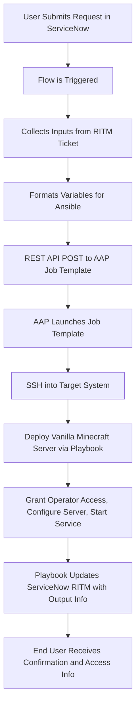

# Deploying Vanilla Minecraft Service Through ServiceNow and Ansible Automation Platform

## Introduction

This blog explores how to deploy a fully operational Vanilla Minecraft server using Ansible Automation Platform (AAP) and ServiceNow. While Minecraft may seem like a lighthearted application, the method used mirrors serious enterprise workflows—making this a great demo and learning opportunity.

We'll walk through the playbook design, ServiceNow integration, and how this architecture scales to more traditional infrastructure and applications.

---

## Overview of the Automation Stack

A high-level look at the tools involved:

- **Ansible Automation Platform**: Executes the automation playbook.
- **ServiceNow**: Acts as the front-end request form.
- **Custom Execution Environment**: Packaged at [quay.io/bgrimmet/starbase/mc-ee](https://quay.io/repository/bgrimmet/starbase/mc-ee).
- **Proxmox/LXC or RHEL VM**: Infrastructure target for Minecraft server.
- **RCON Tooling**: For interacting with the Minecraft server and applying admin privileges post-deploy.

---

## Walking Through the Playbook

### Playbook Purpose and Variables

The playbook is responsible for:

- Destroying any previous Minecraft server deployment
- Deploying and starting a new instance
- Configuring player limits, ops, world seed, and name
- Registering ops via RCON

Variables can be passed via `vars/snow.yml` or from ServiceNow.

---

### Pre-Tasks: Cleanup and Idempotency

Ensure a clean environment by:

- Stopping any running Minecraft service
- Removing `/opt/minecraft`
- Preventing configuration drift

---

### Server Deployment

Key tasks include:

- Creating systemd service for Minecraft
- Downloading the official Minecraft server JAR
- Writing `server.properties` using Ansible templates
- Allocating memory and tuning Java options

---

### Ops List Conversion

Transforms a comma-separated list of players into JSON:

```yaml
server_ops: "Baconator1013, LucasIsCool"
```

Becomes:

```json
[
  {
    "uuid": "",
    "name": "Baconator1013",
    "level": 4,
    "bypassesPlayerLimit": false
  },
  {
    "uuid": "",
    "name": "LucasIsCool",
    "level": 4,
    "bypassesPlayerLimit": false
  }
]
```

These users are then granted server operator permissions using RCON.

---

### Post-Deployment Validation

After starting the service, logs will indicate a healthy server boot:

```
[Server thread/INFO]: Done (35.107s)! For help, type "help"
[Server thread/INFO]: Starting remote control listener
[Rcon: Made Baconator1013 a server operator]
```

---

## Integration with ServiceNow

- Users submit a request in ServiceNow with required variables.
- ServiceNow uses a REST Message to trigger AAP job templates.
- Extra vars are passed via API to populate the playbook inputs.
- Authentication, API endpoints, and job feedback are all configurable.




**Common Issues Encountered**:
- 502 errors due to malformed JSON or missing credentials
- Extra vars formatting matters (`null`, `""`, and `undefined` can behave differently)

---

## How This Maps to Enterprise Workflows

While Minecraft is the demo, the pattern is enterprise-ready:

- **ServiceNow as an interface** for requesting compute resources or application environments
- **AAP as a backend engine** that ensures repeatable, scalable, policy-driven deployments
- **Ops-level customization** like RCON mirrors privileged access automation

---

## Future Improvements

- Auto shutdown idle servers
- Backup world data to object storage (e.g., S3)
- Discord or Mattermost notifications for job completion
- Expand to allow multiple simultaneous world deployments
- Add integration with Event-Driven Ansible for triggers like "player joined"

---

## References

- [Ansible Collection: community.proxmox](https://github.com/ansible-collections/community.proxmox)
- [AAP Minimal Execution Environment](https://catalog.redhat.com/software/containers/ansible-automation-platform-25/ee-minimal-rhel9/650a567e82adff7ec49ffba5)
- [Minecraft Server Setup](https://www.minecraft.net/en-us/download/server)
- [Minecraft Wiki Tutorial](https://minecraft.wiki/w/Tutorial:Setting_up_a_Java_Edition_server)
- [mcrcon by Tiiffi](https://github.com/Tiiffi/mcrcon)
- [Custom Execution Environment](https://quay.io/repository/bgrimmet/starbase/mc-ee)
- [ServiceNow Ansible Setup](https://github.com/shadowman-lab/Ansible-SNOW/tree/main/SNOWSetup)
- [Starbase Minecraft Playbook](https://github.com/BBGrimmett2/Starbase-Vanilla-Minecraft-Deploy)


## Introduction

## Explain the Playbook

```bash
Jul 12 18:59:25 sb-temp01.local.starbase.icu start.sh[309769]: [18:59:25] [Worker-Main-2/INFO]: Preparing spawn area: 4%
Jul 12 18:59:26 sb-temp01.local.starbase.icu start.sh[309769]: [18:59:26] [Worker-Main-2/INFO]: Preparing spawn area: 4%
Jul 12 18:59:26 sb-temp01.local.starbase.icu start.sh[309769]: [18:59:26] [Worker-Main-2/INFO]: Preparing spawn area: 4%
Jul 12 18:59:27 sb-temp01.local.starbase.icu start.sh[309769]: [18:59:27] [Worker-Main-2/INFO]: Preparing spawn area: 4%
Jul 12 18:59:27 sb-temp01.local.starbase.icu start.sh[309769]: [18:59:27] [Worker-Main-2/INFO]: Preparing spawn area: 4%
Jul 12 18:59:28 sb-temp01.local.starbase.icu start.sh[309769]: [18:59:28] [Worker-Main-2/INFO]: Preparing spawn area: 4%
Jul 12 18:59:28 sb-temp01.local.starbase.icu start.sh[309769]: [18:59:28] [Worker-Main-2/INFO]: Preparing spawn area: 4%
Jul 12 18:59:29 sb-temp01.local.starbase.icu start.sh[309769]: [18:59:29] [Worker-Main-2/INFO]: Preparing spawn area: 4%
Jul 12 18:59:29 sb-temp01.local.starbase.icu start.sh[309769]: [18:59:29] [Worker-Main-2/INFO]: Preparing spawn area: 4%
Jul 12 18:59:30 sb-temp01.local.starbase.icu start.sh[309769]: [18:59:30] [Worker-Main-2/INFO]: Preparing spawn area: 4%
Jul 12 18:59:30 sb-temp01.local.starbase.icu start.sh[309769]: [18:59:30] [Worker-Main-2/INFO]: Preparing spawn area: 8%
Jul 12 18:59:31 sb-temp01.local.starbase.icu start.sh[309769]: [18:59:31] [Worker-Main-2/INFO]: Preparing spawn area: 8%
Jul 12 18:59:31 sb-temp01.local.starbase.icu start.sh[309769]: [18:59:31] [Worker-Main-2/INFO]: Preparing spawn area: 8%
Jul 12 18:59:32 sb-temp01.local.starbase.icu start.sh[309769]: [18:59:32] [Worker-Main-2/INFO]: Preparing spawn area: 12%
Jul 12 18:59:32 sb-temp01.local.starbase.icu start.sh[309769]: [18:59:32] [Server thread/INFO]: Time elapsed: 12223 ms
Jul 12 18:59:32 sb-temp01.local.starbase.icu start.sh[309769]: [18:59:32] [Server thread/INFO]: Done (35.107s)! For help, type "help"
Jul 12 18:59:32 sb-temp01.local.starbase.icu start.sh[309769]: [18:59:32] [Server thread/INFO]: Starting remote control listener
Jul 12 18:59:32 sb-temp01.local.starbase.icu start.sh[309769]: [18:59:32] [Server thread/INFO]: Thread RCON Listener started
Jul 12 18:59:32 sb-temp01.local.starbase.icu start.sh[309769]: [18:59:32] [Server thread/INFO]: RCON running on 0.0.0.0:25575
Jul 12 19:00:32 sb-temp01.local.starbase.icu start.sh[309769]: [19:00:32] [Server thread/INFO]: Server empty for 60 seconds, pausing
Jul 12 19:00:47 sb-temp01.local.starbase.icu start.sh[309769]: [19:00:47] [RCON Listener #1/INFO]: Thread RCON Client /172.16.0.247 started
Jul 12 19:00:48 sb-temp01.local.starbase.icu start.sh[309769]: [19:00:48] [Server thread/INFO]: [Rcon: Made Baconator1013 a server operator]
Jul 12 19:00:48 sb-temp01.local.starbase.icu start.sh[309769]: [19:00:48] [RCON Client /172.16.0.247 #2/INFO]: Thread RCON Client /172.16.0.24
```

### Section for each block of work

## Integration with ServiceNow

## How it relates to enterprise

## Future improvments

## Sources
https://github.com/ansible-collections/community.proxmox
https://catalog.redhat.com/software/containers/ansible-automation-platform-25/ee-minimal-rhel9/650a567e82adff7ec49ffba5
https://www.minecraft.net/en-us/download/server
https://minecraft.wiki/w/Tutorial:Setting_up_a_Java_Edition_server
https://github.com/Tiiffi/mcrcon
https://quay.io/repository/bgrimmet/starbase/mc-ee
https://github.com/shadowman-lab/Ansible-SNOW/tree/main/SNOWSetup
https://github.com/BBGrimmett2/Starbase-Vanilla-Minecraft-Deploy 